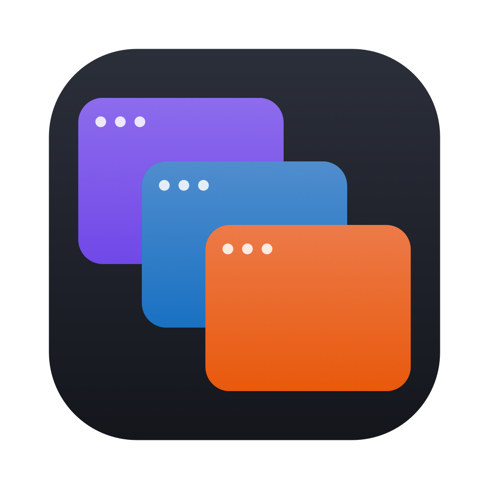
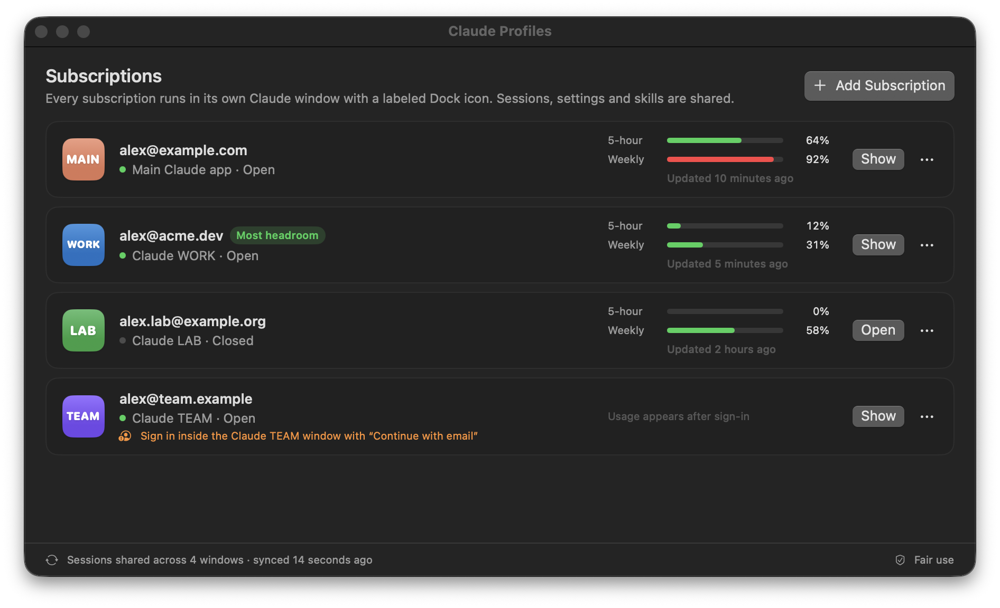
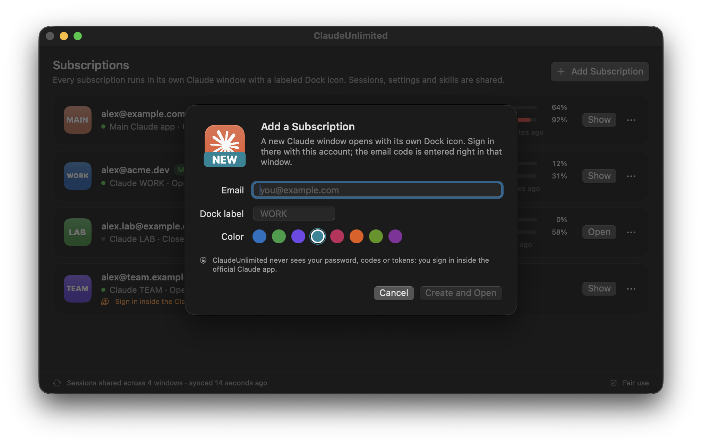

<p align="center">
  
</p>

<h1 align="center">Claude Profiles</h1>

<p align="center">
  <b>All your Claude subscriptions, side by side.</b><br>
  Each of your Claude subscriptions runs in its own Claude Desktop window with its own Dock icon,<br>
  and your Claude Code sessions follow you from one window to the next.
</p>

<p align="center">
  <a href="https://github.com/trukhinyuri/ClaudeProfiles/actions/workflows/ci.yml"></a>
  
  
  <a href="LICENSE"></a>
</p>

<p align="center">
  
</p>

## Why

Claude Desktop holds one signed-in account at a time. If you pay for more than one subscription (a personal plan and a work plan, or one per client), switching means signing out and in again, losing open windows, and hunting for the session you were in.

Claude Profiles gives every subscription its own Claude window with its own Dock icon, all open at once. Your Claude Code sessions, settings, skills and memory stay shared, so you can pick up any session in whichever of your subscriptions you choose to work in, including when one of them has used up its limit for now.

## Features

- **One window per subscription.** Each profile is the official Claude Desktop app running with its own sign-in. No code is patched or injected.
- **Labeled Dock icons.** `WORK`, `LAB` or `TEAM` on a color of your choice tells you which account a window belongs to. The launchers work from Spotlight too.
- **Shared sessions.** Claude Code and Cowork sessions created in any window appear in every window. Deleted and archived sessions stay deleted and archived everywhere.
- **Same setup everywhere.** Before a profile window starts, it gets the main app's extensions, MCP servers, tool toggles, SSH hosts, preferences and theme, and the same sidebar: pinned, starred and unread sessions, groups and filters. Sign-ins are never copied.
- **Usage at a glance.** Five-hour and weekly usage for every subscription, from what Claude Desktop itself records. The one with the most headroom is highlighted.
- **Knows who is signed in.** Every row shows the email of the account in that window and warns if it is not the one you intended.
- **Easy to add and remove.** Enter an email, sign in inside the new window, done. Removing moves the profile to the Trash, so nothing is lost by accident.
- **Menu bar and CLI.** Open any subscription from the menu bar, or script it with `claude-profiles`.
- **Survives Claude updates.** App copies are APFS clones (almost no disk space) and are rebuilt automatically after Claude Desktop updates.

<p align="center">
  
</p>

## Staying within Anthropic’s terms

Claude Profiles is built for people who pay for more than one Claude subscription and use each of them themselves. It deliberately does **not** try to get around how Anthropic meters usage:

| Claude Profiles does | Claude Profiles does not |
|---|---|
| Run the official Anthropic-signed Claude Desktop app for every subscription (a local copy whose only change is its Finder icon) | Patch Claude, inject code or call private APIs |
| Let **you** sign in to each window with the official sign-in flow | See, store, copy or forward passwords, email codes or OAuth tokens |
| Show usage that Claude Desktop already records locally | Proxy, pool, share or combine limits between accounts |
| Let **you** choose which window to work in | Switch accounts automatically when a limit is reached |
| Keep every subscription separate, each with its own limits | Help anyone share one subscription among several people |

Each subscription keeps its own limits, applied by Anthropic as usual; Claude Profiles doesn’t raise any of them. Use only subscriptions that are yours and follow Anthropic’s [Consumer Terms](https://www.anthropic.com/legal/consumer-terms) and [Usage Policy](https://www.anthropic.com/legal/aup). If your plans come from an employer, check that their policies allow this setup. This project is not legal advice.

## Install

Requirements: macOS 14 or later, [Claude Desktop](https://claude.ai/download) in `/Applications`, and Xcode or the Command Line Tools (`xcode-select --install`).

```sh
git clone https://github.com/trukhinyuri/ClaudeProfiles.git
cd ClaudeProfiles
make install        # builds Claude Profiles.app and copies it to ~/Applications/Claude Profiles
```

Builds are signed ad hoc on your Mac, so Gatekeeper doesn’t get involved. If you download a prebuilt `.zip` from [Releases](https://github.com/trukhinyuri/ClaudeProfiles/releases) instead, macOS will ask you to confirm the first launch in **System Settings → Privacy & Security → Open Anyway**.

## Use it

1. Open **Claude Profiles** and click **Add Subscription**.
2. Enter the account’s email and, if you like, change the Dock label and color.
3. A new Claude window opens. Sign in there with that account, with Google or with email.
4. To keep a profile in the Dock, drag its launcher from `~/Applications/Claude Profiles` (**⋯ → Show Launcher in Finder**) to the Dock. Spotlight finds launchers too (“Claude WORK”). Don’t use **Keep in Dock** on a running profile window: that pins the app copy itself, which opens without the profile’s sign-in.
5. When a subscription runs out, open the same session from the sidebar of another window and keep going.

> [!IMPORTANT]
> Don’t work in the same session from two windows at the same time. Close it in one before continuing in another.

To remove a subscription, choose **⋯ → Remove Subscription…**. Its window closes and its app copy and sign-in move to the Trash; sessions stay available everywhere else.

### Command line

```text
claude-profiles list                          Show every profile, its account and plan usage
claude-profiles add <email> [--label TEXT] [--color #RRGGBB]
                                               Create a profile and open it to sign in
claude-profiles open <profile>                Open a profile's window (id or label)
claude-profiles remove <profile>              Quit it and move its copy and sign-in to the Trash
claude-profiles sync                          Share Claude Code and Cowork sessions across profiles now
claude-profiles refresh                       Rebuild app copies after a Claude Desktop update
```

The binary ships inside the app: `ln -s ~/Applications/Claude\ Profiles/Claude\ Profiles.app/Contents/Helpers/claude-profiles /usr/local/bin/`.

## How it works

| What | Where |
|---|---|
| Main Claude app (untouched) | `/Applications/Claude.app`, data in `~/Library/Application Support/Claude` |
| Profile app copies (APFS clones with a Finder icon) | `~/Applications/Claude Profiles/.engines` |
| Launchers you can keep in the Dock | `~/Applications/Claude Profiles/Claude <LABEL>.app` |
| Each profile’s sign-in and window state | `~/Library/Application Support/Claude Profiles/Profiles/<id>` |
| Profile list and backups | `~/Library/Application Support/Claude Profiles` |
| Claude Code sessions, settings, skills, memory | `~/.claude` (already shared by every window) |

A profile is Claude Desktop started with its own `--user-data-dir`, which is standard Electron behavior. Session sharing copies the small index cards Claude Desktop keeps for each Claude Code session into every account’s folder; the conversations themselves already live in `~/.claude`. Cowork sessions are shared the same way, from their own index cards; since Cowork keeps no deletion marker, Claude Profiles remembers what each folder last held so a card missing from one folder isn’t copied back into it while it might still be deleted there. While any Claude window is open, sharing only adds and updates; deletions are spread only when all windows are closed. Every card it removes is backed up first, as is the first version of the day of every card it overwrites; backups older than a week go to the Trash.

Before a profile window starts, Claude Profiles brings its setup in line with the main app: extensions, MCP servers and tool toggles, SSH hosts, preferences, theme, zoom and language, the Claude Code builds the main app has already downloaded (as APFS clones), and the sidebar state Claude keeps in its Local Storage. The main app wins, except for a setting you changed only in the profile’s window since it last started. Scheduled tasks stay switched off in profiles, so each task runs once, in the main app. Right after its first sign-in, a profile’s window restarts once: Claude reads sessions and per-account settings only at launch.

Google sign-in finishes in your browser and comes back to Claude through a `claude://` link, which macOS normally hands to the main Claude app. While a profile window is signing in, Claude Profiles leaves only that window’s app copy registered for those links, and gives them back to the main app as soon as the profile is signed in (or after 15 minutes). The link goes from macOS straight to Claude; Claude Profiles never reads it.

More detail: [docs/ARCHITECTURE.md](docs/ARCHITECTURE.md).

### Privacy

Claude Profiles has no network code and no telemetry. To show who is signed in and how much is used, it reads three things from Claude Desktop’s data: the ID of the signed-in account (`lastKnownAccountUuid` in `config.json`), the account email, which it finds by scanning Claude’s local IndexedDB cache and keeps nothing else from, and the local usage history. Inside Claude’s data it writes session index cards, deletion markers and archive lists, and, in profiles only, the setup and sidebar state listed above. In a profile’s `config.json` it sets only the theme, zoom and language and leaves the rest of the file, including that profile’s sign-in, as it was. Tokens, cookies and passwords are never copied from one window to another. Everything else it writes is its own files and the Finder icon of each profile’s app copy.

## FAQ

**Does this combine the limits of my subscriptions?**
No. Each subscription is metered on its own by Anthropic. Claude Profiles only makes it quick to move to another window you are already signed in to.

**Why not switch accounts automatically when a limit is hit?**
That would amount to automated limit evasion. You decide where to work; the app only shows where there is headroom.

**What about scheduled tasks?**
They run in the main Claude app only. Profiles get the main app’s settings with scheduling switched off, so a task never runs in two windows at once.

**Does it work with Team or Enterprise seats?**
Technically yes, a profile can sign in to any account. Whether you may use a work seat this way is up to your organization.

**What happens when Claude Desktop updates?**
Profile copies are rebuilt from the new version the next time you open them (or right away with `claude-profiles refresh`). Your sign-ins stay.

## Known limitations

- Archive lists are merged: a session archived in any window is archived in all of them, and un-archiving it in one window doesn’t stick. Undoing the merge safely would need Claude Desktop to tell stale writes from real changes.
- Claude Desktop doesn’t lock sessions across windows. Work in a session from one window at a time.
- Sidebar and interface settings reach a profile window when it starts. Changes you make in the main app while a profile window is open show up there after that window restarts.
- What is live stays in the window doing it: which session is running or waiting for you, and the Sessions list on the home screen.
- Features Anthropic turns on per account or organization, such as Routines, appear only in windows whose account has them.
- A session started without a project folder is listed under its own folder name in profile windows, not under “No folder”: Claude recognizes those scratch folders only inside its own data directory.
- Cowork keeps a session’s files in the data of the window that started it, so removing a profile removes the Cowork sessions started in it from every window. They go to the Trash with the profile.
- There is no Developer ID signature yet, so prebuilt downloads need a one-time “Open Anyway”.

## Uninstall

Remove your profiles in the app first (this quits them and moves their data to the Trash), then:

```sh
make uninstall
rm -rf ~/Library/Application\ Support/Claude\ Profiles ~/Applications/Claude\ Profiles
```

## Contributing

Issues and pull requests are welcome; see [CONTRIBUTING.md](CONTRIBUTING.md). Run `make test` before sending a change.

## License

[MIT](LICENSE) © Yuri Trukhin

Claude Profiles is an independent project and is not affiliated with, endorsed by or sponsored by Anthropic. Claude is a trademark of Anthropic, PBC.
